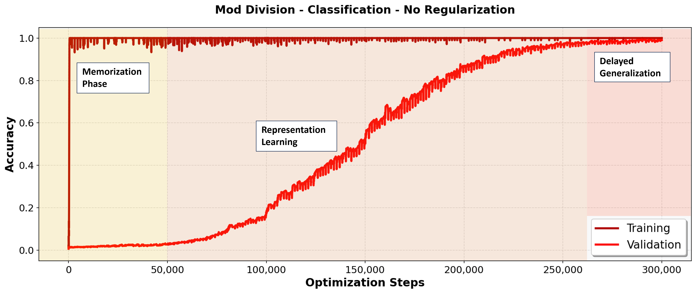

# Grokking

An extension of the OpenAI 'Grokking: Generalization Beyond Overfitting on Small Algorithmic Datasets' paper in PyTorch. Originally forked and modified from:

https://github.com/danielmamay/grokking

---



**Figure**: Grokking Example for modular division without any regularization (No weight decay, no dropout)

## Extension

This fork significantly extends the original in repository in the following ways:

1. Model architecture is changed slightly
2. Training logging has been extended significantly
3. Additional novel algorithmic tasks have been added
4. A new task representation was added: The algorithmic tasks can now be generated as Seq2Seq tasks **in arbitrary number bases**, for example Base 2. The goal of the model is then not just to predict one number, but to predict multiple tokens autoregressively. This necessitated major overhaul of the data generation module and the training routine.
5. Multitask Grokking was added, enabling training on multiple distinct parts simultaneously.

## Motivation

Grokking is the phenomenom of delayed generalization even after overfitting on training data.
This presents an intriguing theoretical puzzle, as there exists no explicit optimization objective in the training process that would account for the sudden improvement in validation accuracy after having achieve zero training loss already.

To better understand the broader applicability of this phenomenon we introduced different representations for the same tasks as in the original paper. Specifically, we examine whether grokking manifests in autoregressive sequence generation tasks that more closely resemble the use of LLMs in practical applications, rather than being limited to single-token classification tasks as demonstrated in the original paper.

Here is an example of the difference between the different task representations (<X> is the token for X, **< X >** in bold is what needs to be predicted by the model.):

| Single-Token Classification (As in original paper) | Sequence-to-Sequence (Variable Operand Length) | Sequence-to-Sequence (Fixed Operand Length)     |
| -------------------------------------------------- | ---------------------------------------------- | ----------------------------------------------- |
| <1> + <3> <=> **< 4 >**                            | <1> <+> <1><1> <=> **< 1 >< 0 >< 0 >< EOS >**  | <0><0><1> <+> <0><1><1> <=> **< 1 >< 0 >< 0 >** |

In addition to that, I was curious if grokking works also in a multitask setting. I was suspicious of how all the grokking examples in literature models were trained specifically for one task only from scratch. To this end I mixed multiple datasets for different tasks and differentiated them by introducing task-specific equal-sign-tokens.

## Installation

* Clone the repo and cd into it:
    ```bash
    git clone https://github.com/lakaschus/grokking.git
    cd grokking
    ```
* Use Python 3.9 or later:
    ```bash
    conda create -n grokking python=3.9
    conda activate grokking
    pip install -r requirements.txt
    ```

## Structure

The structure of the repository is the following:

```
📦 grokking
 ┣ 📂 grokking
 ┃ ┣ 📂 tests
 ┃ ┃ ┗ 📜 __init__.py
 ┃ ┃ ┗ 📜 test_data.py
 ┃ ┃ ┗ 📜 test_integration.py
 ┃ ┃ ┗ 📜 test_training.py
 ┃ ┣ 📜 cli.py
 ┃ ┣ 📜 data.py
 ┃ ┣ 📜 data_encoder.py
 ┃ ┣ 📜 multitask_data.py
 ┃ ┣ 📜 model.py
 ┃ ┗ 📜 training.py
 ┣ 📂 results
 ┃ ┗ 📂 classification_vs_seq2seq
 ┃   ┣ 📜 plot_results.ipynb
 ┃   ┣ 📜 plot_results_new_tasks.ipynb
 ┃   ┗ 📜 plots.ipynb
 ┣ 📂 logs
 ┃ ┣ 📜 validation_examples_in_domain.json (will be created when starting a training run)
 ┃ ┗ 📜 validation_examples_out_of_domain.json (will be created when starting a training run)
 ┣ 📂 dataset
 ┃ ┣ 📜 train_data.json (will be created when starting a training run)
 ┃ ┣ 📜 val_in_data.json (will be created when starting a training run)
 ┃ ┗ 📜 val_out_data.json (will be created when starting a training run)
 ┣ 📜 .gitignore
 ┣ 📜 LICENSE
 ┣ 📜 README.md
 ┣ 📜 requirements.txt
 ┗ 📜 sweep.yaml
 ```

The project is organized into the following main components:


### Core Components

- **Training Module** (`grokking/training.py`): Handles the main training loop, model initialization, and evaluation routines.

- **Data Generation** (`grokking/data.py`, `grokking/data_encoder.py`): 
  - Implements various algorithmic tasks (modular arithmetic, binary operations, etc.)
  - Supports two task types:
    1. Classification: One-token prediction
    2. Sequence-to-sequence: Binary number representation with autoregressive prediction

- **Model Architecture** (`grokking/model.py`): Standard transformer-decoder architecture with configurable layers, dimensions, and heads.

### Experiment Infrastructure

- **CLI Interface** (`grokking/cli.py`): Command-line interface for running experiments with configurable hyperparameters.

- **Experiment Tracking**:
  - Integration with Weights & Biases for experiment logging
  - Support for both online and offline tracking modes

- **Results Analysis** (`results/classification_vs_seq2seq/`):
  - Jupyter notebooks for analyzing experimental results
  - Comparison scripts between classification and sequence tasks

- **Hyperparameter Search**:
  - Grid Search to test robustness of Grokking (`sweep.yaml`)

## Usage

### Experiment Tracking

The project uses [Weights & Biases](https://wandb.ai/site) to keep track of experiments. Run `wandb login` to use the online dashboard, or `wandb offline` to store the data on your local machine.

### Running Experiments

Basic command structure:
```bash
python grokking/cli.py [options]
```

**Parameters:**

*Training & Model Parameters*

- `--num_layers`: Number of transformer layers (default: 2)
- `--dim_model`: Model dimension (default: 128)
- `--num_heads`: Number of attention heads (default: 4)
- `--dropout`: Dropout rate (default: 0.1)
- `--batch_size`: Batch size (default: 512)
- `--learning_rate`: Learning rate (default: 1e-3)
- `--weight_decay`: Weight decay for regularization (default: 1)
- `--device`: Training device ("cuda" or "cpu")
- `--num_steps`: Total number of training steps

*Task Configuration*

- `--operation`: Type of operation (e.g., "x/y_mod", "x+y_mod", "x^2+y^2_mod")
- `--task_type`: "**classification**" or "**sequence**"
- `--multitask`: Enables multitask learning
- `--base`: Number base for operations for Seq2Seq task representation (default: 2)
- `--fixed_sequence_length`: Use fixed sequence length operands for seq2seq tasks (E.g. "001 + 011 = 100" vs. "1 + 11 = 100")
 
*Data Generation*

- `--training_fraction`: Fraction of data used for training (default: 0.5)
- `--max_bit_length_train`: Maximum bit length of training example (This will determine the size of your training set, which will be 2^max_bit_length_train)
- `--max_bit_length_val_out`: Needs to be larger than `max_bit_length_train` in order to measure out-of-domain accuracy
- `--wandb_tracking`: Weights & Biases tracking mode ("maximal", "minimal", "disabled")

**--> Check out `.vscode/launch.json` for various example configurations!**