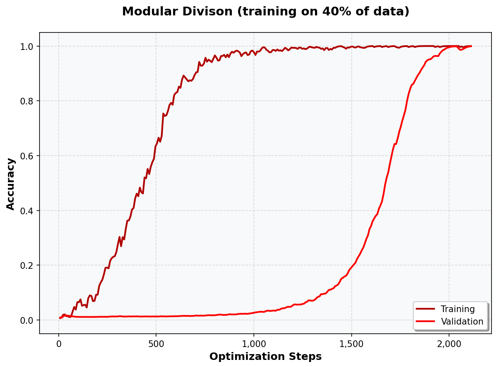

# Grokking

An implementation of the OpenAI 'Grokking: Generalization Beyond Overfitting on Small Algorithmic Datasets' paper in PyTorch. Forked from:

https://github.com/danielmamay/grokking



## Extension

This fork significantly extends the original in repository in the following ways:

1. Model architecture is changed slightly
2. Training logging has been extended significantly
3. Additional algorithmic tasks have been added
4. A new task representation was added: The algorithmic tasks can now be generated as Seq2Seq tasks in binary number representation. The goal of the model is then not just to predict one number, but to predict multiple tokens autoregressively. This necessitated major overhaul of the data generation module and the training routine.

## Installation

* Clone the repo and cd into it:
    ```bash
    git clone https://github.com/lakaschus/grokking.git
    cd grokking
    ```
* Use Python 3.9 or later:
    ```bash
    conda create -n grokking python=3.9
    conda activate grokking
    pip install -r requirements.txt
    ```

## Usage

The project uses [Weights & Biases](https://wandb.ai/site) to keep track of experiments. Run `wandb login` to use the online dashboard, or `wandb offline` to store the data on your local machine.


